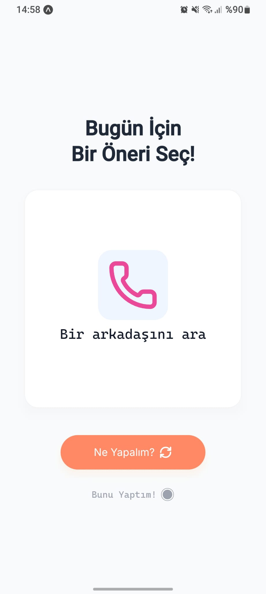

# What To Do

Bu uygulama, kullanıcılara gün içinde yapabilecekleri rastgele öneriler sunarak onlara ilham vermeyi amaçlayan bir mobil uygulamadır. Canınız sıkıldığında veya ne yapacağınıza karar veremediğinizde "Ne Yapalım?" butonuna basarak yeni bir aktivite önerisi alabilirsiniz.

## Kullanılan Teknolojiler

- **React Native**: Mobil uygulama geliştirmek için kullanılan ana framework.
- **Expo**: React Native projelerini kolayca oluşturmak, dağıtmak ve yönetmek için kullanılan bir platform.
- **TypeScript**: Projeye tip güvenliği kazandırmak için kullanılmıştır.
- **Expo Router**: Sayfalar arası navigasyonu yönetmek için kullanılmıştır.
- **NativeWind**: Tailwind CSS'in React Native'de kullanılmasını sağlayan kütüphane.
- **React Native Reanimated**: Akıcı animasyonlar oluşturmak için kullanılmıştır.
- **Lucide React Native**: İkonlar için kullanılmıştır.

## Projeyi Çalıştırma Adımları

- **npm install** ile gereklilikler yüklenir
- **npx expo run:android** ya da
- **npx expo run:ios** ile çalıştırılır

## Ekran Görüntüsü

